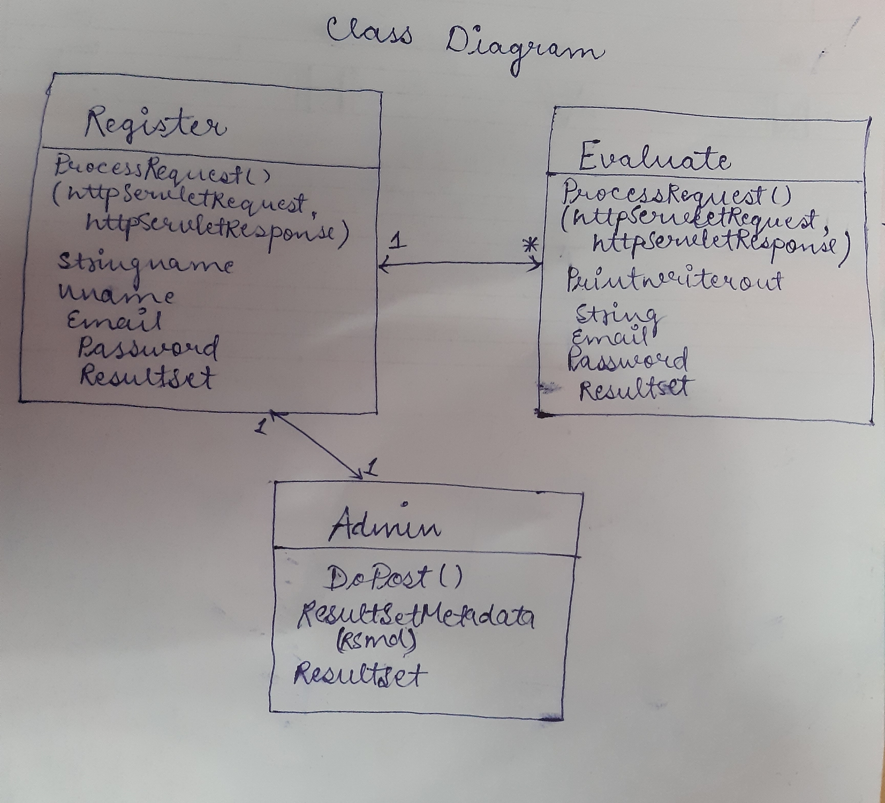

**Objective**: Prepare an online library.

**Users of system**: 
1.client 
2.admin

**Functional requirement of the user**: 
1. CLIENT: login through registered mail id, registration with unique mail id, issue book with its id.
2. ADMIN: login with given username and password(hardcoded as admin), can access library members detail.

**Tools used**:
- Netbeans
- Mysql database

Project working: 
- Welcome Page(Every page is linked on welcome page using ajax jquery) :

- Register Page : 

-Successful Registration on every unique email id :

- Login Window for library member :

- Successful login of library member :

- Admin Login Window : 

- Admin login page :

- Admin library member details update page :

Class Diagram: 

 
ER Diagram:

